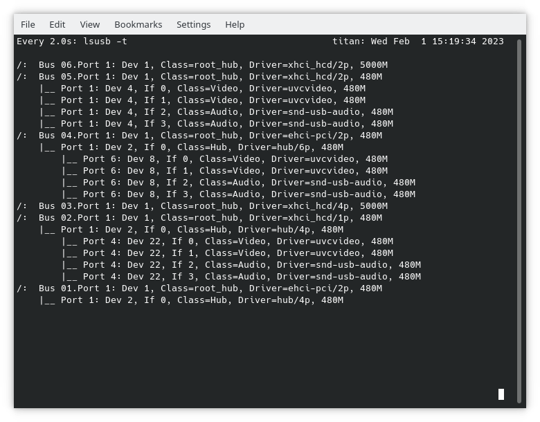
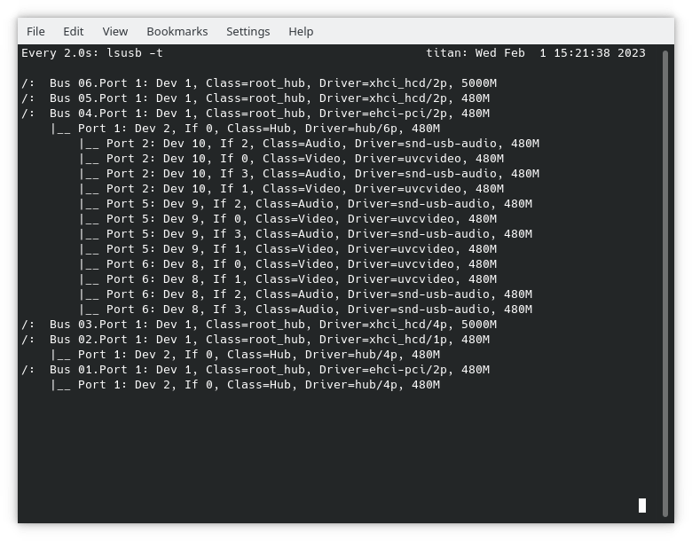
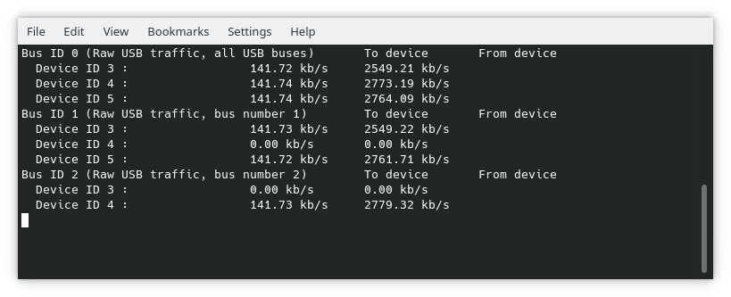

# USB webcam configuration

## Try to connect the cameras to different busses

In case you are usb webcams attach each of the to a different bus of the computer. You can check the usb tree using the following command.

`
lsusb -t
`

Make sure each camera uses its own bus which is not always possible. The output of a perfect setup schould look as shown in the image below. Each camera creates four entries in the usb tree. But each camera is connected to a separate usb bus.

If three cameras are connected to the same bus it looks as in the image below. All three cameras on the same bus is not working while two cameras on one bus is acceptable.

## Monitoring USB speed

You can monitor the amount of traffic currently running in your setup. First you have to load a kernel module to be able to save the information. Then you can start a small tool giving you all the information about currently transferred bytes. 

`
sudo modprobe usbmon
`

`
usbtop
`

You should see an output similar to this.

## Have fun !

Yours
nagilo
