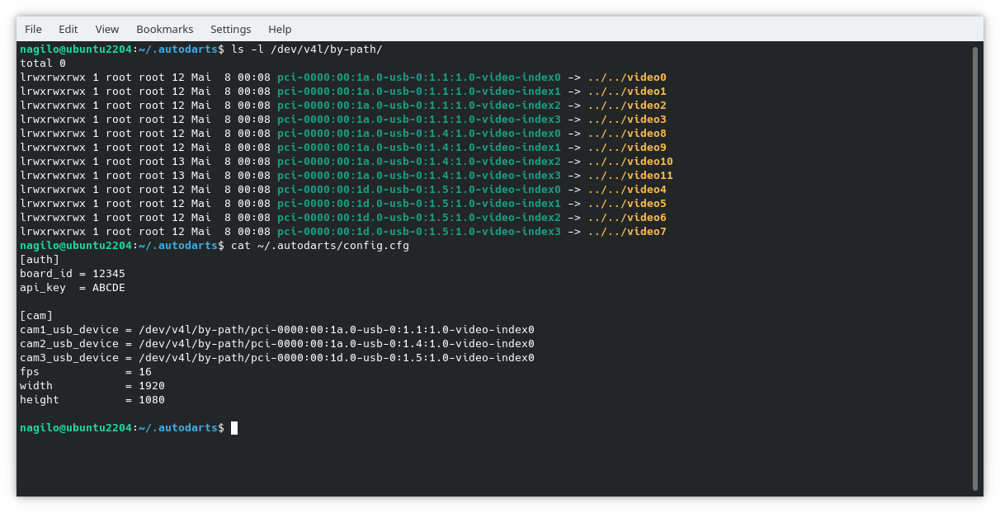

# USB webcam configuration

## Try to connect the cameras to different busses

In case you are usb webcams attach each of the to a different bus of the computer. You can check the usb tree using the following command.

`
lsusb -t
`

Make sure each camera uses its own bus which is not always possible. The output of a perfect setup schould look as shown in the image below. Each camera creates four entries in the usb tree. But each camera is connected to a separate usb bus.

If three cameras are connected to the same bus it looks as in the image below. All three cameras on the same bus is not working while two cameras on one bus is acceptable.

## Monitoring USB speed

You can monitor the amount of traffic currently running in your setup. First you have to load a kernel module to be able to save the information. Then you can start a small tool giving you all the information about currently transferred bytes. 

`
sudo modprobe usbmon
`

`
usbtop
`

You should see an output similar to this.

## Checking all available cameras

In case you want to know which cameras are connected

`
v4l2-ctl --list-devices
`

## Checking current camera settings

In case you want to know the current configuration of your camera you can request those using the following command.

`
v4l2-ctl --device /dev/video0 --list-ctrls-menu
`

## Changing current camera settings

In case you want to change a value of your cameras you can use the following command. This command turns automatic exposure off.

`
v4l2-ctl --device /dev/video0 --set-ctrl auto_exposure=1
`

## Making all settings persistent

If you want to make your camera setting persistent you have to write all commands to change you camera settings into a single file with the name cams.sh which has to be located in the folder /home/${USER}/.autodarts/cams.sh . You can edit the file using any editor of your choice for example nano.

`
nano ~/.autodarts/cams.sh
`

The file contains multiple lines which are identical to the one shown before.

`#!/bin/bash`

`v4l2-ctl --device /dev/video0 --set-ctrl auto_exposure=1`

`v4l2-ctl --device /dev/video0 --set-ctrl white_balance_automatic=0`

`v4l2-ctl --device /dev/video0 --set-ctrl gain=0`

`v4l2-ctl --device /dev/video0 --set-ctrl brightness=4`

`v4l2-ctl --device /dev/video2 --set-ctrl auto_exposure=1`

`v4l2-ctl --device /dev/video2 --set-ctrl white_balance_automatic=0`

`v4l2-ctl --device /dev/video2 --set-ctrl gain=0`

`v4l2-ctl --device /dev/video2 --set-ctrl brightness=4`

`v4l2-ctl --device /dev/video4 --set-ctrl auto_exposure=1`

`v4l2-ctl --device /dev/video4 --set-ctrl white_balance_automatic=0`

`v4l2-ctl --device /dev/video4 --set-ctrl gain=0`

`v4l2-ctl --device /dev/video4 --set-ctrl brightness=4`

## Making camera device names consistent

Usually you are using the names /dev/video0 to access the cameras. In several cases in can happen that the order of the cameras changes between boot. To avoid this there is an alternative device name which depends on the port you have connected the camera to. You can get a list of those names, check which are the ones related to video0 and use the path names in your config file. The image below shows how it should look like. To edit the file you can use nano again.

`
nano ~/.autodarts/config.cfg
`

## Have fun !

Yours
nagilo
